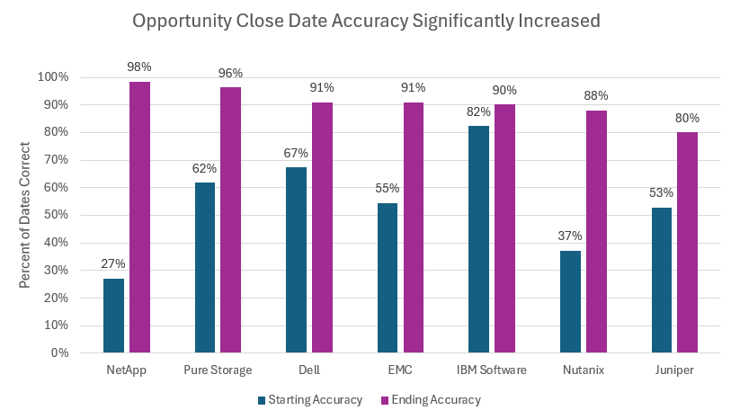

```{r fig-side-by-side, fig.show="hold", out.width="40%", fig.align="center"}
# Image 1

# Caption for Image 1 (can be text below image in Markdown)

# Image 2

# Caption for Image 2 (can be text below image in Markdown)
```
